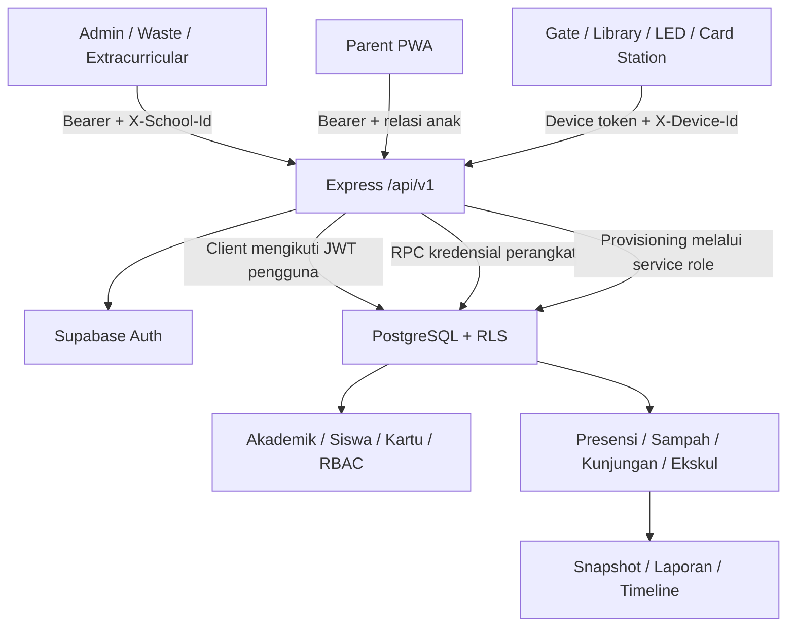

# Laporan Analisis Struktur dan Implementasi AKSIS

Tanggal: 26 September 2026. Objek: working tree lokal AKSES.CO.ID, termasuk perubahan yang belum di-commit. Nama paket: `aksis-platform`, versi `0.3.0`.

## 1. Penilaian utama

AKSIS merupakan platform operasional sekolah multi-tenant dengan satu API Express, sembilan frontend TypeScript/Vite, serta Supabase Auth dan PostgreSQL sebagai pusat identitas dan data. Fondasi pemisahan domain, tenancy, validasi, dan transaksi perangkat sudah cukup luas. Namun, implementasi saat ini **belum layak dinyatakan siap produksi**: beberapa alur utama terputus, otorisasi API tidak konsisten dengan database, dan akses QR memperkenalkan kelemahan lifecycle serta batas kewenangan.

Status yang paling tepat adalah **prototipe terintegrasi menuju pilot**, dengan perbaikan keamanan dan integrasi sebagai prasyarat pilot. Keberhasilan build dan unit test belum membuktikan keberhasilan proses bisnis dengan database nyata.

Temuan paling mendesak:

1. Role `SUPER_ADMIN` masih berasal dari RBAC sekolah, tetapi dipercaya untuk menjalankan service-role operation lintas sekolah.
2. Login QR tidak memeriksa kedaluwarsa atau keberadaan record token sebelum menerbitkan sesi.
3. Katalog permission seed/provisioning tidak sesuai permission yang digunakan route dan RLS.
4. Halaman akses QR admin mempunyai referensi variabel yang tidak terdefinisi.
5. Waste, Library, dan Extracurricular mempunyai ketidaksesuaian kontrak frontend–API.
6. Timeline orang tua menggunakan kolom perpustakaan yang tidak ada dalam migrasi.
7. Pengujian otomatis belum mencakup jalur sukses domain dengan PostgreSQL/RLS nyata.

## 2. Metode dan batas verifikasi

Pemeriksaan mencakup inventaris direktori, package/config, komposisi API, middleware, schema request, frontend, service worker, migrasi, seed, test, kontrak OpenAPI, dan dokumentasi. Alur berisiko ditelusuri dari frontend ke route dan SQL. Dilakukan unit/HTTP-boundary test, typecheck masing-masing aplikasi, dan seluruh build yang tersedia.

Tidak dilakukan deployment, pemanggilan database remote, perubahan akun, migrasi database, uji penetrasi aktif, atau pengujian perangkat fisik. SQL dinilai dari kode; keadaan database terpasang dapat berbeda dari migrasi lokal. Nilai rahasia dan password tidak disalin ke laporan. Pemeriksaan ini bukan sertifikasi keamanan, pengukuran coverage menyeluruh, atau pembuktian semua cabang runtime.

Label bukti:

- **Terbukti lokal:** diperoleh melalui compiler, test, build, atau inventaris file.
- **Terlihat pada kode:** ketidaksesuaian dapat ditelusuri langsung; belum direproduksi melalui browser/database nyata.
- **Perlu validasi runtime:** dampak akhir bergantung konfigurasi, grants, deployment, data, atau concurrency.

## 3. Inventaris proyek

| Komponen | Jumlah/kondisi |
| --- | --- |
| Aplikasi | 10: satu API dan sembilan frontend |
| Berkas route API | 19 |
| Migrasi SQL | 13 |
| Tabel aplikasi yang dideklarasikan | 38 |
| Tabel dengan pernyataan enable RLS | 38/38 |
| Pernyataan create policy | 63 |
| Pernyataan create/create-or-replace function | 28, termasuk penggantian fungsi lama |
| Path pada OpenAPI | 55, berdasarkan inventaris statis |
| Test Vitest | 77 dalam 14 file |
| SQL integration suite | Satu, untuk perpustakaan |
| Manajemen paket | Satu package.json dan node_modules di root; bukan npm workspaces |
| Status Git awal | 23 file tracked berubah; lockfile, seed, dua migrasi terbaru, dan beberapa file lokal belum tracked |

```text
AKSES.CO.ID/
├── apps/
│   ├── api/                    API Express dan integrasi Supabase
│   │   └── src/
│   │       ├── app.ts          Komposisi middleware/router
│   │       ├── server.ts       HTTP server dan shutdown
│   │       ├── config.ts       Validasi environment
│   │       ├── routes/         Handler 19 domain/resource
│   │       ├── schemas/        Zod dan schema tests
│   │       ├── middleware/     Auth, tenant, permission, audit, error
│   │       ├── lib/            Client DB, logger, metric, response
│   │       └── types/          Ekstensi tipe Express
│   ├── admin-web/              Administrasi sekolah/platform
│   ├── parent-pwa/             Timeline dan relasi anak
│   ├── waste-pwa/              Pencatatan bank sampah
│   ├── extracurricular-pwa/    Kegiatan, sesi, presensi
│   ├── library-terminal/       Scan kartu dan antrean kunjungan
│   ├── led-gateway/            Polling konten dan fallback layar
│   ├── command-center/         Dashboard operasional
│   ├── card-writer/            Antrean penulisan kartu, simulator
│   └── operations-console/     Pengunduhan laporan CSV
├── supabase/
│   ├── migrations/             Schema, RLS, RPC, constraint
│   ├── tests/                  Integration test perpustakaan
│   ├── seed.sql                Bootstrap data/akun lokal
│   └── .temp/                  Metadata CLI lokal
├── docs/                       Blueprint, roadmap, OpenAPI, audit/runbook
├── tooling/                    Runner SQL integration test
├── package.json                Semua script development/build/test
├── package-lock.json           Ada, belum tracked saat audit
└── vitest.config.ts
```

Tidak ditemukan CI workflow, Docker/deployment manifest, direktori firmware gate, shared SDK/package, atau `supabase/config.toml` dalam inventaris proyek.

## 4. Arsitektur dan alur data



Arsitekturnya adalah backend monolit modular dengan beberapa frontend yang dibangun terpisah. Banyak aturan transaksi berada pada stored function PostgreSQL: ingestion, deduplikasi, pergantian tahun ajaran, relasi parent, pemilihan konten LED, dan leasing job kartu. Karena itu, review API TypeScript saja tidak cukup untuk memastikan kebenaran aplikasi.

**Pengguna sekolah:** login Supabase → JWT → `requireAuth` → `X-School-Id` → membership aktif → role/permission → route → user-scoped Supabase client → RLS. Penggunaan user-scoped client merupakan kekuatan desain karena API tidak otomatis menghapus proteksi database.

**Orang tua:** JWT → RPC yang memeriksa `parent_student_links`. Jalur ini tidak memakai tenant header seperti admin; hubungan aktif dengan siswa menjadi penentu akses.

**Perangkat:** token perangkat dan ID diteruskan ke RPC melalui public client. RPC memeriksa hash secret, jenis/status perangkat, dan lifecycle credential; sekolah diambil dari identitas perangkat.

**QR terbaru:** admin membuat shadow user dan membership; token QR dipakai untuk menghitung kredensial login shadow user. Ini berbeda dari parent-link token sekali pakai pada fase sebelumnya. Kedua mekanisme perlu dibedakan jelas dalam rancangan lifecycle.

**Realtime:** implementasi Command Center melakukan polling 30 detik dan LED 15 detik. Ada tabel event/outbox, tetapi tidak ditemukan worker publisher/subscriber Supabase Realtime di source API. Blueprint realtime belum sepenuhnya diwujudkan.

## 5. Teknologi dan pengorganisasian kode

| Lapisan | Implementasi |
| --- | --- |
| Runtime API | Node.js, engine package >=20 |
| HTTP | Express 5, cors, helmet, express-rate-limit |
| Validasi | Zod 4 |
| Database/Auth | @supabase/supabase-js, PostgreSQL/RLS/RPC |
| Logging | Pino dan pino-http |
| Frontend | TypeScript, DOM langsung, HTML/CSS; tidak memakai React/Vue |
| Bundler | Vite 7 |
| QR | qrcode |
| Test | Vitest, Supertest; SQL assertions melalui psql |

Kelebihan pendekatan frontend ini adalah dependensi UI relatif sedikit. Biaya pemeliharaannya meningkat karena rendering string HTML, state, request, dan event handler bercampur. `admin-web/src/app.ts` mencapai 962 baris; beberapa aplikasi dan route lain sangat padat dalam satu atau beberapa baris. Tidak ditemukan formatter/linter dalam script root.

API mempunyai pemisahan folder yang baik, tetapi banyak query dan aturan bisnis tetap berada langsung di route. Belum ada service/repository layer atau kontrak bersama yang mengikat tipe frontend, Zod, OpenAPI, dan schema database. Ketidaksesuaian terbaru menunjukkan dampak langsung dari duplikasi kontrak tersebut.

## 6. Peta database

| Domain | Tabel |
| --- | --- |
| Identitas dan tenancy — 7 | schools, users, roles, permissions, school_users, school_user_roles, role_permissions |
| Akademik dan kartu — 5 | academic_years, classes, students, student_class_history, student_cards |
| Perangkat — 3 | devices, device_credentials, device_heartbeats |
| Kehadiran gerbang — 3 | attendance_rules, attendance_logs, attendance_event_receipts |
| Orang tua — 3 | parent_profiles, parent_link_tokens, parent_student_links |
| Bank sampah — 1 | waste_transactions |
| Ekstrakurikuler — 5 | extracurriculars, extracurricular_sessions, extracurricular_members, extracurricular_attendance, extracurricular_events |
| Perpustakaan — 2 | library_visits, library_events |
| LED — 3 | led_content, led_gateway_heartbeats, led_acknowledgements |
| Dashboard — 1 | dashboard_daily_snapshots |
| Card writer — 2 | card_write_jobs, card_write_logs |
| Audit dan retensi — 2 | audit_logs, data_retention_policies |
| Akses QR — 1 | qr_access_tokens |

Relasi inti: sekolah memiliki tahun ajaran dan kelas; siswa dihubungkan ke kelas melalui riwayat, bukan hanya foreign key kelas pada siswa. Kartu merujuk siswa. Aktivitas merekam sekolah dan identitas siswa, sering disertai kelas/perangkat. Membership pengguna dan assignment role dipisahkan dari identitas Supabase Auth.

Fondasi yang baik:

- Composite foreign key `(school_id, id)` pada banyak relasi mencegah relasi lintas tenant.
- Unique constraint satu tahun ajaran aktif, satu riwayat kelas current, dan satu kartu aktif per siswa.
- Event UUID/local sequence untuk deduplikasi presensi/perpustakaan.
- Nilai berat nonnegatif dan `total_kg` sebagai generated column.
- Job kartu memakai lease, row lock, `skip locked`, dan log immutable.
- Seluruh tabel yang dideklarasikan mempunyai enable RLS; banyak juga force RLS.

Catatan: keberadaan RLS bukan bukti bahwa seluruh policy benar. Beberapa policy hanya memanggil `has_school_permission`, sedangkan fungsi itu tidak mengecek status pengguna/sekolah seperti `has_school_access`. Penonaktifan akun/sekolah harus diuji pada seluruh domain, termasuk akses langsung PostgREST.

## 7. Status modul dan permukaan API

| Modul | Kemampuan yang ada | Gap utama |
| --- | --- | --- |
| Auth/IAM | Login, refresh, logout, session, QR generate/login | Lifecycle QR, pemisahan admin platform, konsistensi izin |
| Sekolah | Context, daftar, create, admin sekolah, statistik | Provisioning tidak atomik; daftar platform masih mengikuti RLS membership |
| Akademik | CRUD tahun ajaran/kelas/siswa, history, switch year | Import CSV rapuh; validasi proses lintas domain belum teruji |
| Kartu | List/create/update/block, job writer | Hardware writer masih simulator |
| Device | Register, inventory, config, heartbeat | UI lifecycle rotate/revoke lengkap belum terlihat |
| Gate | Ingestion realtime/sync, rules dan receipts | Tidak ada firmware/hardware client dalam repo |
| Parent PWA | QR login, claim link, daftar anak, timeline | Kolom SQL salah, hanya anak pertama, tanpa refresh sesi otomatis |
| Waste PWA | Input KG/KTG, pencarian siswa, transaksi/ranking | Header tenant hilang; class scope QR belum ditegakkan backend |
| Extracurricular PWA | Pemilihan kegiatan, sesi, scan/enrollment | Endpoint GET sesi tidak ada; payload create/enroll berbeda schema |
| Library terminal | Scan, offline queue, sync | QR pengguna tidak cocok dengan device auth; queue belum aman concurrency |
| LED gateway | State priority, override, cache/fallback, ack | HuiduAdapter hanya mengubah DOM, bukan komunikasi controller |
| Command Center | Snapshot harian, freshness, polling | Provisioning sesi belum lengkap; cache tanpa tenant key |
| Operations console | CSV empat domain | Tidak ada login/provisioning sesi terpadu, export terbatas |
| Audit/monitoring | Append audit, metrics, runbook | Audit tidak transaksional/lengkap; metric hanya satu proses |

Kelompok route: `/auth`, `/schools`, `/classes`, `/academic-years`, `/students`, `/students/:id/history`, `/cards`, `/devices`, `/device/attendance`, `/parent`, `/waste`, `/extracurriculars`, `/library`, `/device/library`, `/led`, `/device/led`, `/dashboard`, `/card-writer`, `/device/card-writer`, `/reports`, `/monitoring`. Business API berada di bawah `/api/v1`; health tersedia di `/health` dan `/api/v1/health`.

## 8. Temuan prioritas

P0 = batas keamanan yang harus diperbaiki sebelum paparan pengguna produksi. P1 = penghambat alur utama/akurasi data. P2 = ketahanan, skalabilitas, dan pemeliharaan.

### F01 — P0: kewenangan platform dipercaya dari role milik tenant

**Bukti:** `apps/api/src/middleware/tenant.ts`, `routes/schools.ts`, dan policy IAM pada migrasi core. `requireRole("SUPER_ADMIN")` membaca role sekolah terpilih. Route provisioning kemudian menggunakan service client untuk membuat sekolah atau admin di sekolah target. Sementara itu, izin `iam.manage` dapat mengelola roles dan assignment melalui policy database; provisioning sekolah baru memberikan izin tersebut ke SCHOOL_ADMIN.

**Dampak:** pengguna yang dapat memodifikasi katalog role tenant berpotensi memperoleh nama role yang dipercaya sebagai otoritas platform. Ini merupakan ketidaktepatan batas kepercayaan, walaupun eksploitasi langsung belum dijalankan terhadap deployment.

**Perbaikan:** buat identitas/assignment admin platform yang hanya dapat dikelola control plane tepercaya. Larang tenant membuat atau mengubah role platform; lakukan pemeriksaan global sebelum setiap service-role operation. Tambahkan pengujian eskalasi dua tenant melalui API dan PostgREST.

### F02 — P0: expiry dan pencabutan token QR tidak mengendalikan login

**Bukti:** `routes/auth.ts:75` dan `:97`, migrasi `202609240013_phase_17_qr_access.sql`. Generate mengirim `p_expires_at: null`; login hanya menghitung shadow email/password lalu `signInWithPassword`. Tidak ada pembacaan record token/expiry sebelum login. Metadata `class_id` bukan batas otorisasi yang ditegakkan route waste.

**Dampak:** mengubah expiry atau menghapus record QR saja tidak otomatis menonaktifkan akun shadow atau sesi. Pesan “sudah kadaluarsa” tidak sesuai pemeriksaan yang dilakukan. Token yang tercetak menjadi kredensial berulang tanpa lifetime yang terdefinisi.

**Perbaikan:** token terbatas waktu/scope dengan revocation yang memutus akses; validasi atomik sebelum penerbitan sesi; server menetapkan kelas dari scope token. Jangan mengandalkan parameter URL sebagai pembatas kelas.

### F03 — P0: RPC shadow access mempunyai pemeriksaan administratif yang lebih lemah

**Bukti:** migrasi QR, fungsi `generate_shadow_access`. Pemeriksaan hanya mencari membership dan kode role; tidak memeriksa membership ACTIVE/deleted, role aktif, status pengguna/sekolah, atau allowlist role tujuan. Fungsi security-definer tidak menetapkan search_path dan tidak memiliki revoke/grant eksplisit seperti RPC lain. Fungsi menulis langsung ke `auth.users`.

**Dampak:** pencabutan membership/status dapat tidak konsisten pada jalur RPC; role berprivilege dapat dijadikan shadow account jika tersedia. Penulisan schema auth langsung memerlukan pembuktian kompatibilitas. Grants efektif harus diperiksa di database.

**Perbaikan:** helper otorisasi konsisten, role allowlist, fixed search_path, explicit grants, lifecycle teruji, dan provisioning auth melalui mekanisme administratif yang terkontrol.

### F04 — P1: seed dan provisioning permission tidak cocok dengan API/RLS

**Bukti:** `supabase/seed.sql:52`, `routes/schools.ts:83`, `routes/waste.ts:3`, `routes/library.ts:35`, `routes/extracurriculars.ts:14`. Seed berisi `waste.manage`/`library.manage`, sementara API dan RLS memakai `waste.create`, `waste.read`, `library.read`. Izin `extracurricular.read`, `extracurricular.attendance`, `parent.manage`, `led.read`, `monitoring.read`, dan `privacy.manage` juga tidak ada dalam daftar seed yang diperiksa.

API membypass permission untuk SCHOOL_ADMIN/SUPER_ADMIN, tetapi fungsi SQL `has_school_permission` tetap membutuhkan grant eksplisit. Role operator baru juga tidak mendapat assignment permission pada proses provisioning yang ada.

**Dampak:** API bisa mengizinkan request tetapi database menolaknya, atau SELECT mengembalikan kosong. Data kosong dapat salah dianggap tidak ada transaksi.

**Perbaikan:** satu katalog permission bersama, seed idempotent per role, dan uji matriks role × endpoint × policy. Hindari memperbaiki masalah ini dengan mengganti seluruh query menjadi service role.

### F05 — P1: halaman akses QR admin gagal sebelum render

**Bukti:** `apps/admin-web/src/app.ts:730` memakai `app.innerHTML`, sedangkan elemen aplikasi diakses melalui `getApp()`. Compiler menghasilkan TS2304. Pada baris 100 juga ada TS2339 untuk `code` pada tipe `{}`.

**Dampak:** jalur halaman QR dapat melempar ReferenceError. Build Vite tetap lulus karena tidak menjalankan typecheck penuh.

**Perbaikan:** konsisten memakai getter elemen dan tipe membership yang benar; jadikan typecheck frontend bagian quality gate.

### F06 — P1: Bank Sampah gagal memperoleh konteks kelas

**Bukti:** `apps/waste-pwa/src/main.ts:94`. Request awal ke `/classes` hanya membawa Authorization. API mewajibkan `X-School-Id`. Respons login sudah memiliki schools, tetapi init waste tidak memanfaatkannya untuk request ini.

**Dampak:** tenant middleware mengembalikan 400, kemudian frontend gagal membaca `data.find` dan menghapus sesi. Alur QR dapat tampak seperti login gagal.

**Perbaikan:** tetapkan tenant tervalidasi dari hasil login, kirim header, gunakan `/classes/:id`, dan tangani error envelope secara eksplisit.

### F07 — P1: QR perpustakaan berbeda protokol dengan terminal

**Bukti:** admin `app.ts:857` menghasilkan `?token=...` untuk LIBRARY_STAFF. `library-terminal/src/main.ts:7` membaca `device` dan `secret`, lalu mengirim `Authorization: Device`.

**Dampak:** QR yang diberikan admin tidak melakukan provisioning credential yang diperlukan terminal. Kegagalan autentikasi scan juga dimasukkan ke antrean seolah offline.

**Perbaikan:** pilih flow operator-user atau device provisioning secara eksplisit dan sambungkan UI dengan endpoint yang sesuai. Bedakan error permanen 4xx dari kegagalan jaringan.

### F08 — P1: tiga kontrak utama Ekstrakurikuler tidak cocok

**Bukti:** `apps/extracurricular-pwa/src/main.ts:127`, `:143`, `:223`; `apps/api/src/routes/extracurriculars.ts`; `schemas/extracurricular.ts`.

- Frontend meminta GET `/:id/sessions`, tetapi router hanya menyediakan POST pada path sesi tersebut.
- Create sesi mengirim `starts_at` dan `location`; schema strict meminta `name`, `starts_at`, `ends_at`, tanpa `location`.
- Fast-enroll mengirim student/idempotency key tanpa `confirmed: true` yang diwajibkan schema.

**Dampak:** daftar sesi 404, create dan enrollment 422, setelah kendala auth/permission diatasi.

**Perbaikan:** selaraskan kontrak dan tambahkan satu E2E lengkap: kegiatan → sesi → siswa belum terdaftar → konfirmasi → hadir.

### F09 — P1: timeline orang tua merujuk kolom yang tidak ada

**Bukti:** migrasi `202609230012_phase_16_parent_timeline.sql:32` memakai `visited_at`; tabel `library_visits` mendefinisikan `occurred_at`. Tidak ditemukan migrasi rename/add `visited_at`.

Frontend juga membaca `ev.extra_info` tanpa deklarasi tipe, menghasilkan TS2339. Nilai deskripsi tersebut dimasukkan ke HTML tanpa escape. Semua kegagalan dashboard menghapus session lalu menampilkan ulang login.

**Dampak:** terhadap schema repo, pemanggilan fungsi timeline berpotensi gagal SQL; pengguna bisa melihat “Akses Ditolak” padahal penyebabnya error server.

**Perbaikan:** selaraskan kolom/tipe, escape teks, dan bedakan 401 dengan error data/jaringan. Uji timeline yang berisi seluruh empat domain aktivitas.

### F10 — P1: import CSV salah memisahkan baris dan tidak atomik

**Bukti:** `apps/admin-web/src/app.ts:548` menggunakan `text.split("\\n")`, yaitu literal backslash+n, bukan newline normal. Parser kolom hanya `split(",")`; penyimpanan dilakukan POST per siswa secara berurutan.

**Dampak:** CSV normal dapat menghasilkan nol baris impor; quoted comma tidak ditangani. Kegagalan tengah batch meninggalkan sebagian data dan retry berpotensi konflik.

**Perbaikan:** parser CSV yang benar, preview error per baris, validasi backend, idempotency batch, dan laporan hasil impor.

### F11 — P1: provisioning sekolah dapat melaporkan sukses parsial

**Bukti:** `routes/schools.ts:58` menjalankan insert sekolah, role, permission, akun, membership, dan assignment dalam banyak request. Beberapa hasil error diabaikan. Respons 201 beserta kredensial dikembalikan walaupun pembuatan akun gagal.

**Dampak:** sekolah tercipta tanpa admin/permission lengkap; retry dapat membuat konflik dan akun yatim. Endpoint tambahan `/:id/admin` juga belum memiliki kompensasi kegagalan lintas langkah.

**Perbaikan:** transaksi bagian database, pemeriksaan semua error, workflow provisioning berstatus dengan kompensasi Auth, serta idempotency key. Validasi body dan school ID dengan schema ketat.

### F12 — P1: statistik platform salah tabel dan terbatas RLS sekolah

**Bukti:** `routes/schools.ts:42` melakukan query `cards`, sedangkan tabel yang ada adalah `student_cards`; error diabaikan dan count menjadi 0. Daftar sekolah/statistik menggunakan user client sehingga tetap dibatasi membership RLS, meskipun role API bernama SUPER_ADMIN.

**Dampak:** dashboard platform dapat menampilkan angka salah atau tidak lengkap.

**Perbaikan:** perbaiki nama tabel, propagasi error, dan sediakan query agregat lintas tenant hanya setelah otorisasi platform yang aman sesuai F01.

### F13 — P1: risiko DOM XSS pada data kegiatan/timeline

**Bukti:** `extracurricular-pwa/src/main.ts:103` memasukkan nama/kode kegiatan langsung ke innerHTML; nama juga dimasukkan ke atribut onclick berisi string JavaScript. Parent menampilkan extra_info sebagai HTML. Command Center juga merender nilai dinamis melalui template HTML.

**Dampak:** data yang mengandung markup/quote dapat merusak UI dan, pada deployment tanpa proteksi efektif, menjalankan script dalam origin aplikasi. Token browser dapat terdampak. Header Helmet pada API tidak otomatis berlaku untuk static hosting frontend.

**Perbaikan:** textContent/DOM API, event listener tanpa inline JS, encoding sesuai konteks, dan CSP pada host frontend. Uji payload pada field yang benar-benar dapat disimpan/dibaca pengguna.

### F14 — P1: antrean perpustakaan berisiko kehilangan/stagnasi data

**Bukti:** `library-terminal/src/main.ts:10` membaca seluruh queue, mengirimkannya, lalu `save([])`. Scan baru yang masuk saat request berjalan ikut terhapus. Batch frontend tidak dibatasi, sedangkan schema/RPC membatasi 500 event. Tidak ada lock sync; semua respons non-OK pada scan dianggap offline.

**Dampak:** kehilangan event baru saat sync, antrean >500 tidak terkirim, dan error credential/kartu permanen dapat menahan antrean.

**Perbaikan:** IndexedDB, hapus hanya event ID yang diakui, chunk <=500, mutex sync, retry/backoff, dan pemisahan event gagal permanen. Uji scan saat sync serta putus jaringan setelah commit.

### F15 — P1: laporan kelas dapat memberi angka/periode menyesatkan

**Bukti:** `routes/reporting.ts:6` dan `admin-web/src/app.ts:645`. UI menawarkan periode, tetapi request class-report tidak membawa filter periode. Query backend menghitung lintas waktu; beberapa error query turunan diabaikan dan diganti nol. Ringkasan waste/library mengambil raw rows tanpa pagination, sehingga kelengkapan bergantung batas row server. Export umum dibatasi 10.000 tanpa pemberitahuan pemotongan.

**Dampak:** judul laporan berperiode tidak menjamin data berperiode, angka nol dapat berarti query gagal, dan agregat besar berisiko kurang hitung.

**Perbaikan:** filter rentang waktu/timezone server, aggregate SQL, propagasi error, reconciliation test, serta ekspor paginated/streaming atau background job.

### F16 — P1: kredensial dan cache belum terisolasi secara memadai

**Bukti:** terminal library, LED, writer menyimpan device secret dalam localStorage. Command Center menyimpan snapshot dengan satu key tanpa school/user. File lokal `apps/akun akses.md`, `test_login.js`, dan seed memuat penanda kredensial/akun; nilainya tidak dicantumkan di sini. File akun/test login belum tracked saat pemeriksaan.

**Dampak:** XSS atau pengguna lokal dapat mengakses secret; fallback snapshot dapat menampilkan data tenant sebelumnya pada browser bersama. Berkas kredensial berisiko ikut commit kemudian.

**Perbaikan:** provisioning perangkat dan penyimpanan secret yang sesuai runtime produksi; key cache per tenant/user, purge saat perubahan sesi; pindahkan kredensial lokal dari source. Bila kredensial tersebut aktif dan pernah dibagikan, rotasi sesuai cakupannya.

### F17 — P2: PWA belum membuktikan kemampuan offline penuh

**Bukti:** beberapa service worker hanya precache `/`; JS/CSS hasil build tidak di-cache secara eksplisit. Admin/parent melakukan runtime caching, sementara worker sederhana lain tidak menyimpan response fetch ke cache. Semua app mendaftarkan `/sw.js` dengan asumsi root hosting.

**Dampak:** HTML tersedia offline tidak menjamin aplikasi dapat dijalankan. Deployment beberapa app pada origin/path yang sama berpotensi bentrok scope dan cache; parent/admin menghapus cache lain pada origin yang sama saat activate.

**Perbaikan:** tentukan subdomain/base path tiap app, versioned precache asset, update lifecycle, dan uji offline setelah reload. Pastikan endpoint data sensitif tetap dikecualikan walau API base URL berubah.

### F18 — P2: audit/observability belum dapat dijadikan bukti transaksi lengkap

**Bukti:** audit middleware baru dipasang setelah router auth, parent, dan device. Penyimpanan dilakukan setelah response finish, tanpa before/after/resource ID dan tanpa transaksi bersama mutasi. Pembuatan QR dan registrasi device tidak tercakup middleware ini. Metrics adalah counter satu proses dan sampel durasi 1.000 request. Health tidak mengecek database.

**Dampak:** operasi berhasil dapat tidak mempunyai audit saat proses mati/RPC gagal; incident correlation dan readiness terbatas. `pinoHttp` mengambil request ID dari header asli, bukan ID baru di `req.requestId`, sehingga log default dapat tidak membawa ID yang dikembalikan ke klien.

**Perbaikan:** audit transaksional/outbox, cakupan aksi sensitif, perbaikan correlation ID, readiness terpisah, dan metrics terpusat dengan label/rentang pengukuran yang jelas.

### F19 — P2: konfigurasi pengembangan/deployment tidak seragam

**Bukti:** admin/parent/waste mempunyai proxy `/api`, tetapi extracurricular dan library tidak; extracurricular hardcode `/api/v1`. Beberapa app lainnya juga tidak mempunyai proxy default. `.env.example` tidak mencantumkan service-role key yang kini dipakai provisioning. README API masih mengatakan jangan memakai service role. CORS example menunjuk port 5173, sementara frontend utama memakai 4173–4177.

**Dampak:** beberapa script dev menghasilkan halaman yang memanggil API pada origin Vite yang salah; provisioning gagal dengan konfigurasi contoh. Perbedaan CORS relevan saat frontend mengakses API lintas origin, bukan saat memakai proxy same-origin.

**Perbaikan:** dokumentasikan origin/port/base URL setiap aplikasi, reverse proxy deployment, konfigurasi CORS, dan secret backend. Service client sebaiknya gagal jelas bila secret administratif tidak tersedia, bukan fallback diam-diam ke anon key.

### F20 — P2: kualitas kontrak dan reproduksibilitas belum terjaga

**Bukti:** script typecheck hanya API; tidak ada CI/lint/format/SDK generated. OpenAPI belum memuat QR, platform stats, atau class-report terbaru. Lockfile ada tetapi belum tracked. Audit terdahulu menyebut seed/lockfile belum ada, sedangkan keduanya sekarang ada di working tree.

**Dampak:** build hijau dapat membawa runtime bug, kontrak antaraplikasi menyimpang, dan checkout bersih berbeda dari mesin pengembang.

**Perbaikan:** commit artefak yang memang diperlukan setelah review, CI typecheck seluruh app + test + build + SQL integration, validasi/drift OpenAPI, dan kontrak bersama.

## 9. Pengujian yang dijalankan

| Pemeriksaan | Hasil |
| --- | --- |
| npm test | 77/77 lulus, 14/14 file |
| npm run typecheck | Lulus; hanya API |
| Typecheck tiap app | 8/10 lulus; admin-web dan parent-pwa gagal |
| Semua script build | 10/10 lulus: API dan sembilan frontend |
| Inventaris SQL/RLS statis | 38 tabel, semua memiliki enable RLS |
| SQL library integration | Tidak dijalankan: tidak memakai database disposable dalam audit ini |
| E2E browser | Tidak dijalankan; suite tidak ditemukan |
| Hardware, load, restore drill | Tidak dijalankan |

Error compiler yang ditemukan:

```text
apps/admin-web/src/app.ts(100,44): TS2339 Property 'code' does not exist on type '{}'.
apps/admin-web/src/app.ts(730,3): TS2304 Cannot find name 'app'.
apps/parent-pwa/src/main.ts(12,36): TS2339 Property 'extra_info' does not exist on type event.
```

Percobaan test pertama di sandbox gagal membuat server HTTP lokal untuk Supertest: 47 test lulus, 30 gagal pada server address. Setelah pengujian diulang dengan izin membuka port lokal, seluruh 77 test lulus. Kegagalan awal tersebut bukan bukti regresi aplikasi.

Sebanyak 30 test API terutama menguji envelope, health, validasi input, dan penolakan request tanpa credential. Test tersebut tidak menjalankan happy path dengan database Supabase nyata. Karena itu, status lulus tidak membantah F01–F20. Tidak dilakukan klaim persentase coverage karena coverage belum diukur.

## 10. Kesenjangan terhadap blueprint

| Sasaran blueprint | Kondisi implementasi |
| --- | --- |
| Satu pusat identitas dan data | Sudah menjadi dasar arsitektur |
| Multi-school isolation | RLS/composite FK tersedia; matriks pengujian belum dibuktikan menyeluruh |
| Offline-first edge | Primitif server ada; queue browser terbatas dan firmware gate belum tersedia |
| Realtime | Polling dan event tables; publisher/subscriber belum ditemukan |
| Hardware gate/LED/writer | Gate firmware tidak ada; LED DOM adapter; writer simulator |
| Admin dan operasional terintegrasi | UI bertambah, tetapi beberapa flow belum tersambung kontraknya |
| Parent privacy | Relation-based access ada; QR lifecycle dan cache/render perlu perbaikan |
| Production operations | Runbook tertulis; deployment, alert, restore dan load evidence belum tersedia |

Tidak diberikan persentase “selesai” atau status Done per fase tanpa bukti exit criteria. Dokumen blueprint adalah target, bukan gambaran akurat seluruh runtime saat ini.

## 11. Urutan perbaikan dan kriteria penerimaan

| Urutan | Pekerjaan | Kriteria penerimaan |
| --- | --- | --- |
| 1 | Batas admin platform, QR lifecycle, RPC authorization | Admin sekolah tidak bisa menjadi admin platform; token expired/revoked ditolak; membership nonaktif tidak dapat generate QR |
| 2 | Katalog permission dan bootstrap | Sekolah baru mempunyai role/permission lengkap; hasil API dan RLS konsisten untuk setiap persona |
| 3 | Typecheck dan kontrak fitur utama | 10 app typecheck lulus; QR admin, waste, library, ekskul, parent berhasil E2E |
| 4 | Migrasi/seed pada database disposable | Seluruh 13 migrasi berhasil; test dua tenant dan revocation lulus; timeline tidak gagal SQL |
| 5 | Integritas import, laporan, queue | CSV multiline/quoted valid; periode akurat; tidak kehilangan scan saat sync; queue >500 dapat habis |
| 6 | CI dan dokumentasi | Lockfile tracked, pipeline all-app, OpenAPI sinkron, petunjuk dev/deploy dapat diikuti dari checkout bersih |
| 7 | Pilot perangkat/staging | Adapter fisik diuji, beban jam masuk terukur, offline/power-loss diuji, alert dan restore drill terdokumentasi |

Target struktur lanjutan yang disarankan: pertahankan satu API, tetapi pisahkan service/domain untuk provisioning, permission, reporting, dan QR. Tambahkan shared contracts/API client agar semua frontend membawa envelope, tenant, refresh, dan error handling yang sama. Pilihan framework UI dapat ditentukan kemudian; perbaikan kontrak dan keamanan lebih mendesak daripada penulisan ulang frontend.

## 12. Artefak dan cakupan perubahan audit

Audit ini menambahkan laporan ini. Source aplikasi dan migrasi tidak diperbaiki dalam pekerjaan analisis. Build menghasilkan artefak dist yang diabaikan Git. Seluruh perubahan working tree pengguna yang sudah ada dipertahankan.

Referensi utama: `docs/BLUEPRINT.md`, `docs/TECHNICAL_EXECUTION_ROADMAP.md`, `docs/IMPLEMENTATION_AUDIT.md`, `docs/openapi.yaml`, `docs/operations/PRODUCTION_READINESS.md`, serta lokasi source yang disebutkan pada setiap temuan. Nomor baris mengacu pada working tree saat audit dan dapat bergeser sesudah perubahan berikutnya.
