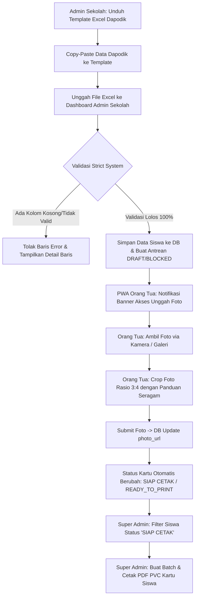

# Alur Kerja (Workflow) Produksi ID Card Pelajar AKSIS

Dokumen ini menjelaskan alur kerja terintegrasi antara **Admin Sekolah**, **Orang Tua Siswa (PWA)**, dan **Super Admin (Platform AKSIS)** untuk pencetakan ID Card PVC secara presisi.

---

## 📋 Standard Operating Procedure (SOP) & Alur Data

---

## 1. Unggah Data Dapodik (Admin Sekolah)
1. Admin sekolah mengunduh format Excel/CSV resmi dari menu **/student-import**.
2. Kolom template disesuaikan dengan ekspor Dapodik:
   - `Nama Lengkap` *(Wajib)*
   - `NISN` *(Wajib & Unik)*
   - `Kelas` *(Wajib)*
   - `Tempat Lahir` *(Wajib)*
   - `Tanggal Lahir` *(Wajib: format YYYY-MM-DD)*
   - `Alamat` *(Wajib)*
   - `Jenis Kelamin` *(Wajib: L/P)*
3. **Validasi Strict Backend**: Jika terdapat kolom `Alamat`, `Tanggal Lahir`, atau field wajib lainnya yang kosong, sistem menolak baris tersebut dan menampilkan daftar baris yang harus diperbaiki.

---

## 2. Pembentukan Antrean Cetak & Status Kartu Initial (Super Admin)
1. Siswa yang berhasil diimpor otomatis terdaftar dalam antrean kartu di sistem.
2. Karena foto dari orang tua belum diunggah, status kartu berada pada kondisi `BLOCKED` / `FOTO BELUM ADA`.

---

## 3. Pemberitahuan & Upload Foto Siswa (PWA Orang Tua)
1. Orang tua membuka PWA Orang Tua (`/parent`).
2. Jika siswa belum memiliki foto resmi, beranda PWA menampilkan **Banner Peringatan Prominensial**:
   > **Aksi Diperlukan:** Unggah foto siswa untuk pencetakan ID Card sekolah.
3. Mengklik tombol **"Unggah Foto"** membuka antarmuka kamera / galeri HP (`capture="user"`).
4. Panduan resmi ditampilkan: *"Gunakan seragam sekolah resmi, berdasi, tanpa topi, latar belakang polos."*
5. Fitur **Interactive Cropper 3:4** mengunci rasio foto 3:4 secara pas sehingga wajah siswa presisi pada ID Card PVC tanpa gepeng/melar.

---

## 4. Perubahan Status Otomatis & Produksi (Super Admin)
1. Setelah foto disubmit oleh orang tua, status kartu otomatis diperbarui menjadi `SIAP CETAK` (`READY_TO_PRINT`).
2. Super Admin membuka modul **Produksi Kartu Siswa** (`/platform-card-jobs`).
3. Super Admin memfilter siswa dengan status **SIAP CETAK (Foto Lengkap)**.
4. Klik **"Buat batch & QR"** -> **"Cetak / Simpan PDF"** untuk dicetak langsung pada printer kartu PVC.
